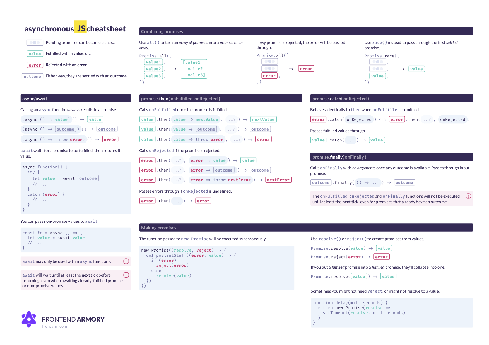

# Asynchronous JavaScript cheatsheet

This cheatsheet contains a summary of the [Mastering Asynchronous JavaScript](https://frontarm.com/courses/async-javascript/) course at [Frontend Armory](https://frontarm.com/browse/).

Want to deepen your understanding of promises, `async` and `await`? The course will guide you there through **47 live examples and exercises.** To get started, just click through to the first lesson: [Why async, anyway?](https://frontarm.com/courses/async-javascript/promises/why-async/).

Want a printable-optimized PDF version but don't want to build it yourself? There's one included in [the course](https://frontarm.com/courses/async-javascript/in-practice/cheatsheet/).